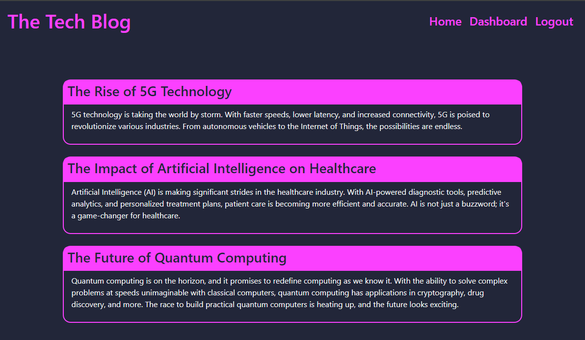
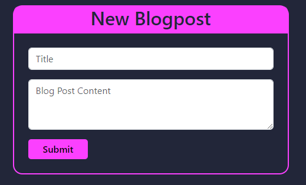
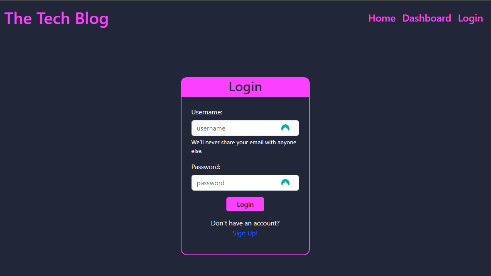

 <!-- Improved compatibility of back to top link: See: https://github.com/othneildrew/Best-README-Template/pull/73 -->

<!--
*** Thanks for checking out the Best-README-Template. If you have a suggestion
*** that would make this better, please fork the repo and create a pull request
*** or simply open an issue with the tag "enhancement".
*** Don't forget to give the project a star!
*** Thanks again! Now go create something AMAZING! :D
-->

<!-- PROJECT SHIELDS -->
<!--
*** I'm using markdown "reference style" links for readability.
*** Reference links are enclosed in brackets [ ] instead of parentheses ( ).
*** See the bottom of this document for the declaration of the reference variables
*** for contributors-url, forks-url, etc. This is an optional, concise syntax you may use.
*** https://www.markdownguide.org/basic-syntax/#reference-style-links
-->
[![Contributors][contributors-shield]][contributors-url]
![Languages][top-lang-shield]
![Commits][commits-shield]
[![Issues][issues-shield]][issues-url]
[![MIT License][license-shield]][license-url]

<!-- PROJECT LOGO -->
 

  

<h1 align="center">The Tech Blog</h1>

  

    A CMS-style blog site, where devs can publish their blogposts and comment on other developers' posts.
      
    <a href="https://warm-brushlands-22664-151feb64557a.herokuapp.com/">Visit the deployed site here</a>
  

<!-- TABLE OF CONTENTS -->

  
Table of Contents

  <ol>
    <li><a href="#about-the-project">About The Project</a></li>
    <li><a href="#installation">Installation</a></li>
    <li><a href="#usage">Usage</a></li>
    <li><a href="#contributing">Contributing</a></li>
    <li><a href="#license">License</a></li>
    <li><a href="#contact">Contact</a></li>
  </ol>

<!-- ABOUT THE PROJECT -->
## About The Project

An interactive blog platform, designed in a Content Management System (CMS) style, provides a dedicated space for developers to publish their blog articles and engage in discussions by commenting on posts authored by their peers. This comprehensive full-stack application encompasses both front-end and back-end functionalities. It includes RESTful API endpoints for creating, reading, updating, and deleting data from a MySQL database. The implementation of this functionality involves various Node.js frameworks and libraries, including Express.js, Express-sessions, Sequelize, Handlebars.js, and bcrypt.

(<a href="#readme-top">back to top</a>)

<!-- Installation instructions -->
## Installation

No installation necessary

(<a href="#readme-top">back to top</a>)

<!-- USAGE EXAMPLES -->
## Usage

To use this application, simply visit the deployed site <a href="">here</a> 

Here's a quick peek at what you can expect to see!

(<a href="#readme-top">back to top</a>)

## Tech Stack

(<a href="#readme-top">back to top</a>)

<!-- CONTRIBUTING -->
## Contributing

N/A

(<a href="#readme-top">back to top</a>)

<!-- LICENSE -->
## License

Distributed under the MIT License. See `LICENSE.txt` for more information.

(<a href="#readme-top">back to top</a>)

<!-- CONTACT -->
## Contact

<h4>Email - <a href="mailto:jmorrison.m44@gmail.com">jmorrison.m44@gmail.com</a></h4>

<h4>GitHub - <a href="https://github.com/jradmorrison">jradmorrison</a></h4>

<h4>LinkdIn - <a href="https://linkedin.com/in/jradmorrison">jradmorrison</a></h4>

Project Link - [The Tech Blog](https://github.com/jradmorrison/tech-blog)

(<a href="#readme-top">back to top</a>)

<!-- MARKDOWN LINKS & IMAGES -->
<!-- https://www.markdownguide.org/basic-syntax/#reference-style-links -->
[contributors-shield]: https://img.shields.io/github/contributors/jradmorrison/tech-blog.svg?style=for-the-badge
[contributors-url]: https://github.com/jradmorrison/tech-blog/graphs/contributors
[forks-shield]: https://img.shields.io/github/forks/jradmorrison/tech-blog.svg?style=for-the-badge
[forks-url]: https://github.com/jradmorrison/tech-blog/network/members
[stars-shield]: https://img.shields.io/github/stars/jradmorrison/tech-blog.svg?style=for-the-badge
[stars-url]: https://github.com/jradmorrison/tech-blog/stargazers
[issues-shield]: https://img.shields.io/github/issues/jradmorrison/tech-blog.svg?style=for-the-badge
[issues-url]: https://github.com/jradmorrison/tech-blog/issues
[license-shield]: https://img.shields.io/github/license/jradmorrison/tech-blog.svg?style=for-the-badge
[license-url]: https://github.com/jradmorrison/tech-blog/blob/master/LICENSE.txt
[linkedin-shield]: https://img.shields.io/badge/-LinkedIn-black.svg?style=for-the-badge&logo=linkedin&colorB=555
[linkedin-url]: https://linkedin.com/in/jradmorrison
[product-screenshot]: images/screenshot.png
[Next.js]: https://img.shields.io/badge/next.js-000000?style=for-the-badge&logo=nextdotjs&logoColor=white
[Next-url]: https://nextjs.org/
[React.js]: https://img.shields.io/badge/React-20232A?style=for-the-badge&logo=react&logoColor=61DAFB
[React-url]: https://reactjs.org/
[Vue.js]: https://img.shields.io/badge/Vue.js-35495E?style=for-the-badge&logo=vuedotjs&logoColor=4FC08D
[Vue-url]: https://vuejs.org/
[Angular.io]: https://img.shields.io/badge/Angular-DD0031?style=for-the-badge&logo=angular&logoColor=white
[Angular-url]: https://angular.io/
[Svelte.dev]: https://img.shields.io/badge/Svelte-4A4A55?style=for-the-badge&logo=svelte&logoColor=FF3E00
[Svelte-url]: https://svelte.dev/
[Laravel.com]: https://img.shields.io/badge/Laravel-FF2D20?style=for-the-badge&logo=laravel&logoColor=white
[Laravel-url]: https://laravel.com
[Bootstrap.com]: https://img.shields.io/badge/Bootstrap-563D7C?style=for-the-badge&logo=bootstrap&logoColor=white
[Bootstrap-url]: https://getbootstrap.com
[JQuery.com]: https://img.shields.io/badge/jQuery-0769AD?style=for-the-badge&logo=jquery&logoColor=white
[JQuery-url]: https://jquery.com 
[top-lang-shield]: https://img.shields.io/github/languages/top/jradmorrison/tech-blog.svg?style=for-the-badge
[commits-shield]: https://img.shields.io/github/commit-activity/t/jradmorrison/tech-blog.svg?style=for-the-badge
